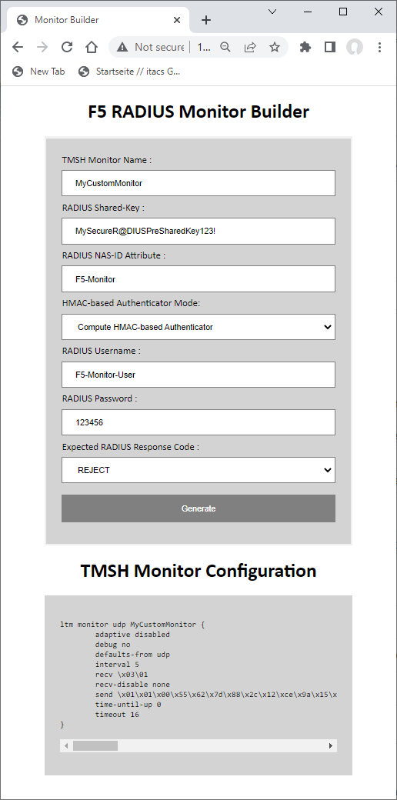

# Introduction

The F5-RADIUS-HealthMonitor-Builder iRule can be used to compute tailordered  UDP payload SEND/RECV strings to health monitor RADIUS Server instances.

LTMs build-in RADIUS-Monitor has unfortunately the limitation that it always requires a "ACCESS-Accept" RADIUS response to decide that a given Pool Member is healthy. 

In the case that a RADIUS Service always responds with a "ACCESS-Challenge" RADIUS response or that you want to probe TOTP-based RADIUS Services which usually requiring time-based tokens as password you can't use the build-in RADIUS-Monitor to check availability.

A couple years ago the DevCentral Users Boneyard, Jan Holz am me had a [discussion on DevCentral](https://community.f5.com/t5/technical-forum/when-using-the-radius-monitor-should-the-f5-accept-the-access/td-p/123733) how such RADIUS Services could be monitoried by deploying generic UDP-based Health Monitors with tailordered SEND/RECV UDP payload strings. The outcome of this discussion was then used by F5 to publish [K30713256](https://support.f5.com/csp/article/K30713256).

I recently run into the problem that the rather static UDP payload used in our initial solution, does not work in more advanced RADIUS Health Monitoring scenarios, where for example a specific USER-NAME / PASSWORD value or a specific NAS-ID value must be used, or when the RADIUS Service requires the use of HMAC-based RADIUS-Request signing. 

I ended up to recycle code snippets of my [RADIUS Client Stack](https://github.com/KaiWilke/F5-iRule-RADIUS-Client-Stack) and wrapped them into a simple iRule hosted Web-Application which provides an easy to use web interface to construct [RFC2865](https://tools.ietf.org/html/rfc2865) compliant RADIUS requests and RADIUS Response regex signatures.

# Interface

The Web-Interface provides a free-text field to specify the name of the Health-Monitor, a free-text field to specify the RADIUS-PreShared-Key used for PASSWORD attribute encryption and HMAC-based Request Authenticator signing, a free-text field to specify a NAS-ID attribute, a dropdown menu to enable/disable the usage of HMAC-based Request Authenticator attributes, a free-text field to specify the USERNAME attribute, a free-text field to specify the PASSWORD value and last but not least the desired RADIUS Response code to mark the RADIUS Server instance as healthy.

Once you click on the "Generate" button, the Web-Interface will update an present a TMSH Configuration snippets containinng tailordered UDP payload strings ready to import into your LTM.



# Installation of the RADIUS Client Stack Processor

To install the F5-RADIUS-HealthMonitor-Builder on F5 LTM you need to perform the steps below:

1.	Create an empty iRule on your F5 LTM System and copy the TCL Code of the F5-RADIUS-HealthMonitor-Builder iRule into it. Press Save to deploy the iRule on your system.

2. Create a new TCP-based Virtual Server including the default HTTP profile. 

```
ltm virtual VS_F5-DEV_17_12_HTTP80 {
    description "F5 RADIUS Monitor Builder"
    destination 10.0.17.12:80
    ip-protocol tcp
    mask 255.255.255.255
    profiles {
        http { }
        tcp { }
    }
    serverssl-use-sni disabled
    source 0.0.0.0/0
    translate-address enabled
    translate-port enabled
}
```
3. Attach the F5-RADIUS-HealthMonitor-Builder iRule created in step 1 to the just created Virtual Server.
4. Use a Web Browser to navigate to the just created HTTP-based Virtual Server.
